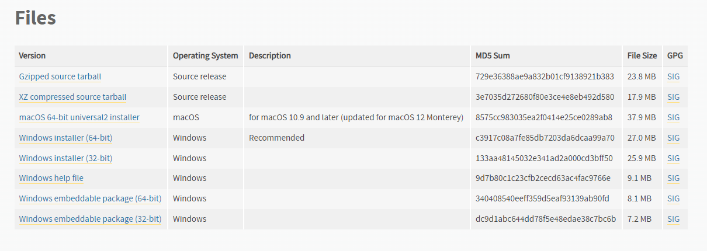
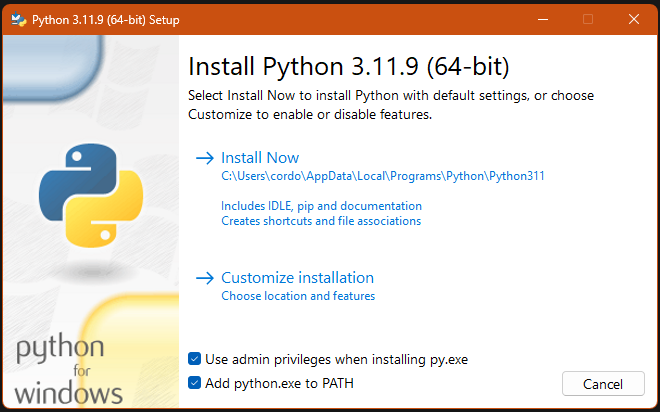
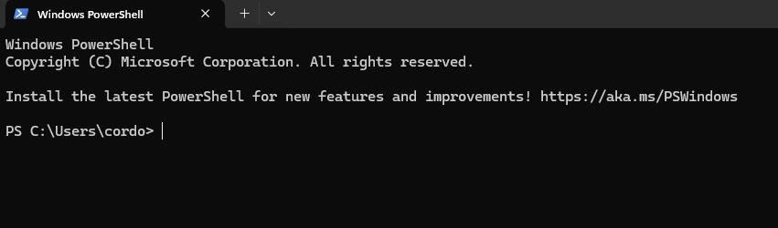
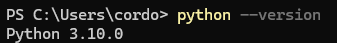
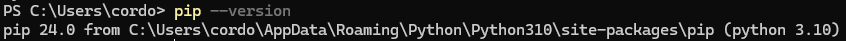

# Automated AFM analysis

## Install guide

Depending on your use case you may have different requirements, but in general your requirements should look like this:

* python 3.9 or higher
* compatible numpy version
* compatible matplotlib version
* compatible scipy version


### Install python
----------
-**Read this in its entirety before starting the install**

-**This guide is focused on windows machines**

----------


go to [python download page](https://www.python.org/downloads/release/python-3100/) and on the lower part, choose the apropiare download version for your computer. 

 

If you don't know what install is the best and you are on windows download the recommended 64b version. 



Here choose your install path and make sure to check the box that adds python to the path. 

Now choose customize installation and make sure *pip* is going to be installed, now click continue until the install is complete.

To test your install, in you windows search bar search for command prompt or powershell and open a new window of said program. 


Now you should see something like this (It will be blue on windows 10, command prompt will be black in all windows versions)



Here you can type the command 

```sh 
python --version
```

and it should return the version you just installed 



If this is the case, python has been correctly installed. 

### Install dependencies

If everything is good with your python install, you should be able to run the command 

```sh
pip --version
```
And see that the pip is associated with your desired python install 



If that is not so, you may have multiple python install, or you may have not installed it properly. You could google "add python to environment variables" or "add pip to environment variables". You wont be able to continue if this *pip check* is not completed successfully. 

Now that you are sure pip works, you can run the following commands one at a time, in your terminal 


```sh
pip install numpy
pip install matplotlib
pip install scipy
```

Also you will need to download the files:
* tribo.py
* PyMi.py 
* agilent_loader.py


Now you should be ready to go. 
## References 
Got .mi code from [this github](https://gitlab.gwdg.de/lambert/agilent-mi-python-loader)